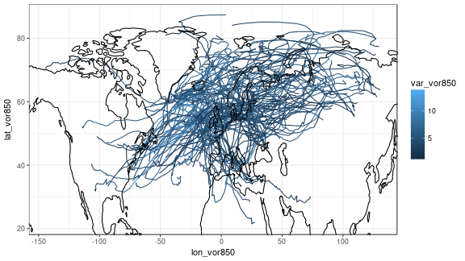
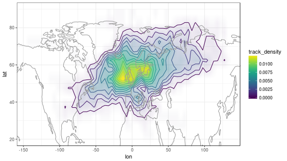
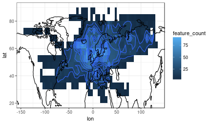

# Storm tracking for Real Projections

An R package to analyse and plot storm tracks and storm track density from reanalyses and climate model data.

The package uses `data.table` and `ggplot2` for fast computation and high quality graphics.


## Installation


```r
devtools::install_github('sieste/realstorms')
library(realstorms)
```


## Usage example

We are working with files of standard ascii output format produced by the
[TRACK storm tracking
software](http://www.nerc-essc.ac.uk/~kih/TRACK/Track.html). (Currently, no data is included with the package, but will soon be.)


```r
stormsfile = 'storms.txt'
writeLines(readLines(stormsfile, n=8))
```

```
## 0
## PER_INFO 1    186.00000
## 0 0
## TRACK_NUM      164 ADD_FLD    4  12 &1111
## TRACK_ID  62 START_TIME 1979100115
## POINT_NUM  30
## 1979100115 340.307587 49.238014 2.256818e+00 & 1.000000e+25 & 1.000000e+25 & 1.004745e+03 & 3.452344e+02 & 5.157880e+01 & 2.585588e+01 & 3.431250e+02 & 5.157881e+01 & 2.522785e+00 & 3.445312e+02 & 5.298231e+01 & -9.085817e-01 & 
## 1979100118 341.067871 48.938240 2.178028e+00 & 1.000000e+25 & 1.000000e+25 & 1.006301e+03 & 3.466406e+02 & 5.228060e+01 & 2.429727e+01 & 3.445312e+02 & 5.298231e+01 & 1.639683e+00 & 3.452344e+02 & 5.298231e+01 & -6.051655e-01 &
```

The function `read_tracks` parses TRACK output into a `data.table`. Variable names can be passed as a function argument:


```r
trx = read_tracks(stormsfile, var=c('vor850', 'mslp', 'speed', 'precip', 'omega'))
head(trx)
```

```
##               ID       date lon_vor850 lat_vor850 var_vor850 lon_mslp
## 1: 1979100115_62 1979100115  -19.69241   49.23801   2.256818       NA
## 2: 1979100115_62 1979100118  -18.93213   48.93824   2.178028       NA
## 3: 1979100115_62 1979100121  -18.19537   49.45507   2.281268       NA
## 4: 1979100115_62 1979100200  -18.89911   49.64317   1.979960       NA
## 5: 1979100115_62 1979100203  -18.51144   48.41359   1.995012       NA
## 6: 1979100115_62 1979100206  -15.55347   47.63854   2.551114 -13.3079
##    lat_mslp var_mslp lon_speed lat_speed var_speed lon_precip lat_precip
## 1:       NA 1004.745  -14.7656   51.5788  25.85588   -16.8750   51.57881
## 2:       NA 1006.301  -13.3594   52.2806  24.29727   -15.4688   52.98231
## 3:       NA 1006.618  -12.6562   54.3858  27.24611   -14.7656   53.68406
## 4:       NA 1006.978  -11.9531   53.6841  24.75781   -13.3594   52.98231
## 5:       NA 1007.700  -11.9531   52.2806  22.95614   -14.0625   51.57881
## 6: 51.20902 1005.944  -11.2500   52.2806  20.60277   -11.9531   49.47356
##    var_precip lon_omega lat_omega  var_omega
## 1:  2.5227850  -15.4688  52.98231 -0.9085817
## 2:  1.6396830  -14.7656  52.98231 -0.6051655
## 3:  1.4330540  -14.0625  50.17531 -0.7044878
## 4:  0.9765621  -13.3594  50.87706 -0.6734438
## 5:  3.1477600  -13.3594  50.17531 -0.6644258
## 6:  1.2753800  -12.6562  51.57881 -0.6119308
```


The function `track_density` splits the world up into grid boxes of width and height `bw` (in degrees) and calculates track count, track density, feature count and feature density:


```r
# calculate track density on a 5x5 degree grid
td = track_density(trx, bw=5)
head(td)
```

```
##                 bin feature_count track_count feature_density
## 1: (-10,-5],(25,30]             1           1    0.0001464987
## 2: (-10,-5],(30,35]            14           3    0.0020509815
## 3: (-10,-5],(35,40]            18           6    0.0026369763
## 4: (-10,-5],(40,45]            21           7    0.0030764723
## 5: (-10,-5],(45,50]            54          20    0.0079109288
## 6: (-10,-5],(50,55]            58          31    0.0084969235
##    track_density lon_min lon_max lat_min lat_max  lon  lat
## 1:  0.0003559986     -10      -5      25      30 -7.5 27.5
## 2:  0.0010679957     -10      -5      30      35 -7.5 32.5
## 3:  0.0021359915     -10      -5      35      40 -7.5 37.5
## 4:  0.0024919900     -10      -5      40      45 -7.5 42.5
## 5:  0.0071199715     -10      -5      45      50 -7.5 47.5
## 6:  0.0110359559     -10      -5      50      55 -7.5 52.5
```

The object `trx` is of class `stormtracks`, and the object `td` is of class `track_density`. Both classes have S3 plotting methods:


```r
plot(trx, var='vor850')
```




```r
plot(td, 'track_density')
```




```r
plot(td, 'feature_count')
```




